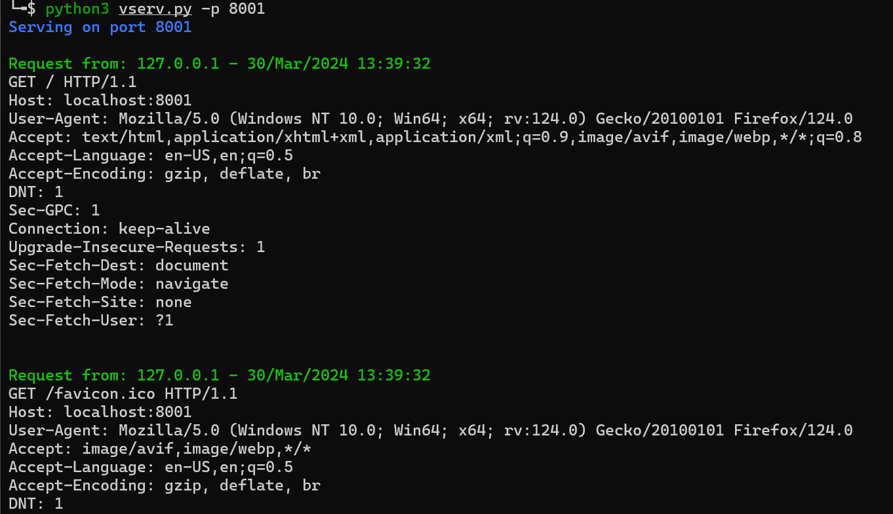

# vserv (verbose server)
Simple web server that logs all request details.



Usage
```
usage: vserv.py [-h] -p PORT [-t TIMEOUT] [-rl REDIRECTLOCATION] [-rs {301,302,303,307,308}] [-re REDIRECTENDPOINT]

Simple web server that logs request details

optional arguments:
  -h, --help            show this help message and exit
  -p PORT, --port PORT  Port to listen on
  -t TIMEOUT, --timeout TIMEOUT
                        Timeout for requests
  -rl REDIRECTLOCATION, --redirectlocation REDIRECTLOCATION
                        Redirect request to the specified URL
  -rs {301,302,303,307,308}, --redirectstatuscode {301,302,303,307,308}
                        Status code to use for redirects
  -re REDIRECTENDPOINT, --redirectendpoint REDIRECTENDPOINT
                        Endpoint to server redirects from. Default is all. Example: test/redir
```